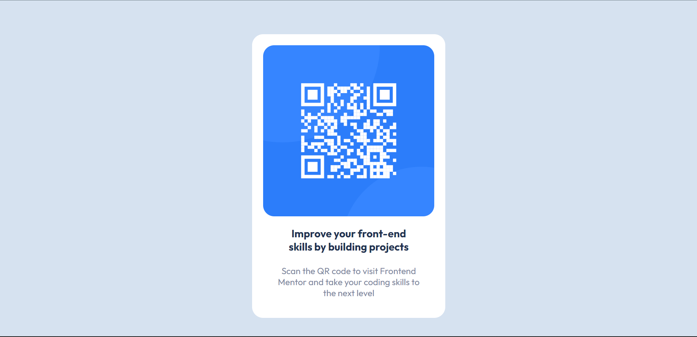

# Frontend Mentor - QR code component solution

This is a solution to the [QR code component challenge on Frontend Mentor](https://www.frontendmentor.io/challenges/qr-code-component-iux_sIO_H). Frontend Mentor challenges help you improve your coding skills by building realistic projects.

## Table of contents

- [Overview](#overview)
  - [Screenshot](#screenshot)
  - [Links](#links)
  - [Built with](#built-with)
  - [What I learned](#what-i-learned)
  - [Continued development](#continued-development)
  - [Useful resources](#useful-resources)
- [Author](#author)
- [Acknowledgments](#acknowledgments)

**Note: Delete this note and update the table of contents based on what sections you keep.**

## Overview

This is a front-end mentor challenge that I took to test my knowledge and application of the web programming languages: HTMl and CSS. The Test was to design a qr-based component.

### Screenshot



### Built with

- Semantic HTML5 markup
- CSS custom properties
- CSS Grid

### What I learned

I learned how to design a card cause the task was to design a qr-component card.

To see how you can add code snippets, see below:

```html
<h6 class="i-text">Improve your front-end skills by building projects</h6>
```

```css
[alt="This is an image of a bar-code scanner"] {
  width: 100%;
  border-radius: 20px;
}
```

### Continued development

I really to work on how to design different projects with ease using html, css and vanilla js before I start using different frameworks to build my projects.

### Useful resources

- [Example resource 1](https://youtu.be/yU-euUrE3Bg?si=hln8i2IbZA4NIF33) - This helped me an overview of how to style a card component. I liked the pattern and will use it going forward.

## Author

- Frontend Mentor - [@Ask4mike](https://www.frontendmentor.io/profile/Ask4mike)
- Twitter - [@mikael_akpanng](https://twitter.com/mikael_akpang)
